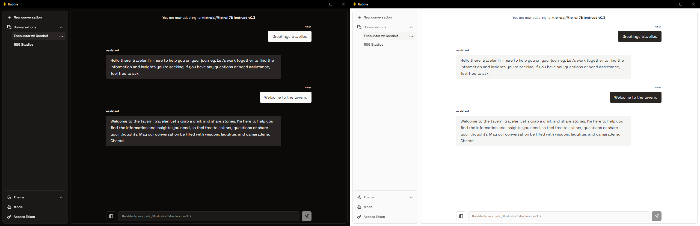

<h1 align="center" >Babble</h1>

<h4 align="center" > A Tauri v2 desktop application for chatting with Hugging Face's language models.</h4>

<div align="center">
    <div>
        
    </div>
    <details>
        <summary><b>Themes preview</b></summary>
        
    </details>
</div>

## Features

- **Interactive Chat Interface**: Clean and responsive UI with support for Markdown rendering in messages
- **Theme Support**: Toggle between light, dark and system theme modes
- **Conversation Management**:
  - Start new conversations
  - Switch between multiple conversations
  - Edit conversation titles
  - Delete conversations
  - Conversation context persistence
- **Model Management**:
  - Switch between different Hugging Face models
  - Support for both warm and cold inference models
- **Message Input**:
  - Auto-expanding textarea
  - Multi-line support with Shift+Enter

## Usage

> [!IMPORTANT]  
> *Currently relies on inference through [huggingface.js](https://github.com/huggingface/huggingface.js). As it relies on inference, you will need to find a model that supports inference. You can find a list of **warm models**[^1] [here](https://huggingface.co/models?inference=warm&pipeline_tag=text-generation). If the options don't satisfy you, you could try browsing the list of **cold models**[^2] [here](https://huggingface.co/models?inference=cold&pipeline_tag=text-generation).*

1. **Enter your [user access token](https://huggingface.co/docs/hub/security-tokens)**: Click on the key icon in the left sidebar to enter your access token. This is required to avoid rate limiting.
2. **Select a model**: Click on the bot icon in the left sidebar to enter a Hugging Face model name (e.g., "mistralai/Mistral-7B-Instruct-v0.3")
3. **Start chatting**: Enter your message and start babbling!

## Building

1. **Install dependencies**:
    ```sh
    npm install
    ```

2. **Run the app**:
    ```sh
    npx tauri dev
    ```

[^1]: When you make a request to the API with a warm model, it means the model has been used recently, and its cache already contains the necessary weights. This allows the model to process your input more quickly, as it doesn't need to download the weights again.
[^2]: When you make a request to the API with a cold model, it means the model has not been used recently, and its cache is empty. In this case, the model will need to download the necessary weights from the cloud before it can start processing your input. This process can take some time, depending on the size of the model and the speed of the network.
